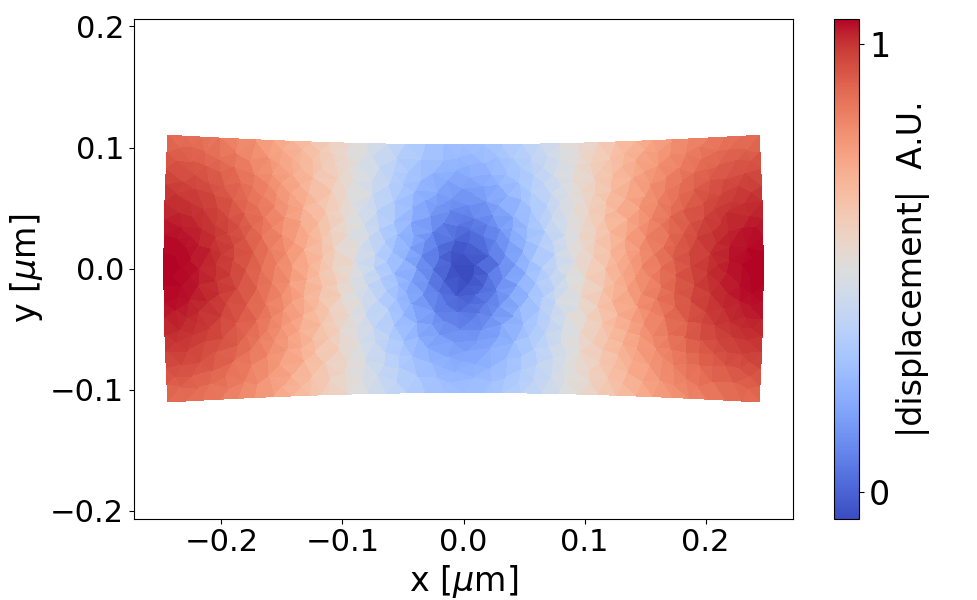

PySBS: Stimulated Brillouin scattering simulations in Python
============================================================

Introduction
------------

PySBS provide a set of easy to use tools for simulations of Brillouin scattering in waveguides. The core of the program is an elastic mode solver which is fully tensorial and enables simulation of anisotropic materials. The solver is coupled with an electromagnetic mode solver to calculate the Brillouin gain with the inclusion of all forces, bulk electrostriction, boundary electrostriction and radiation pressure on the dielectric interface.

Installation
------------

PySBS  requires Python 3 and FEniCS. The full documentation for the later is provided at <https://fenicsproject.org>. It can be installed using pip ::

    pip3 install fenics-ffc --upgrade

PySBS has been written and tested on Ubuntu 18.04.1 LTS. The recommended IDE for python 3 is Spyder3 whose GUI is similar to matlab.

PySBS installation
~~~~~~~~~~~~~~~~~~

You can download the latest version of PySBS from github and install it via ::

    python3 setup.py install

Or, if you wish to edit the source code without re-installing each time ::

    python3 setup.py develop

Examples of use
---------------

The files are located in the examples directory.The documented examples include:

    - Caclulating electromagnetic and elastic modes for silicon waveguide
    - Calculating the elastic and electromagnetic modes of chalcogenide waveguides
    - TODO: document gain calculations currently in the gain directory

License
-------
PySBS is licensed under the `GPLv3 license <http://choosealicense.com/licenses/gpl-3.0/>`_. This means that you are free to use PySBS for any **open-source** project. PySBS is provided "as is" with absolutely no warranty.

References
----------
If you use this package for research please cite the following paper: [TODO arxiv link]

